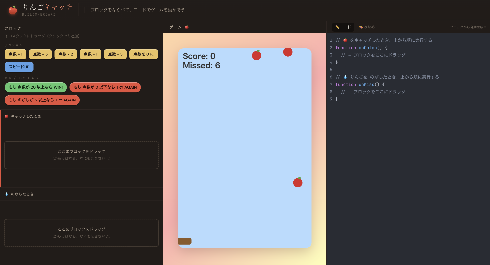
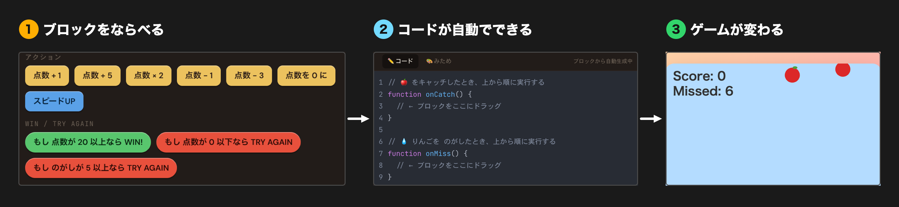
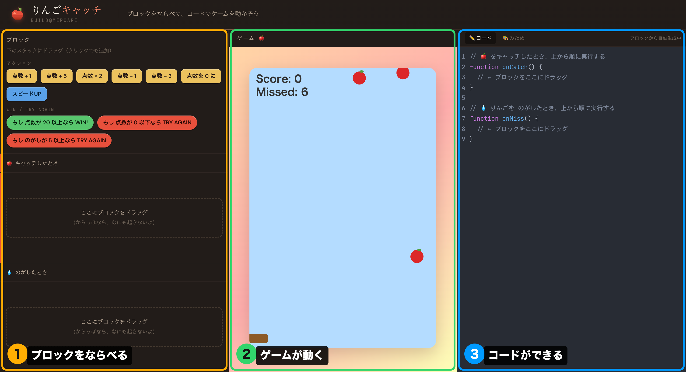
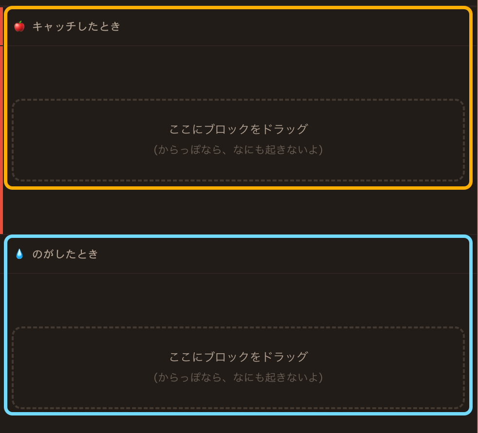
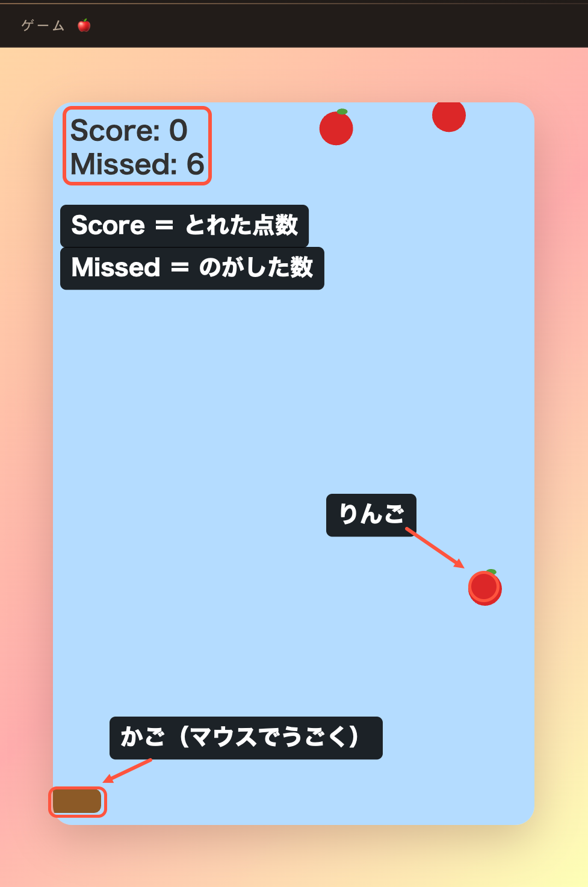
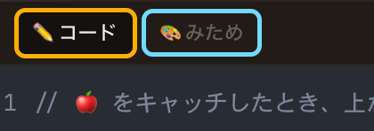
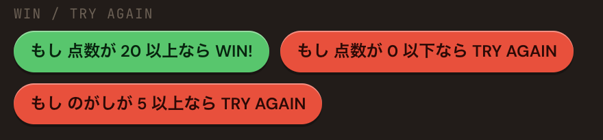
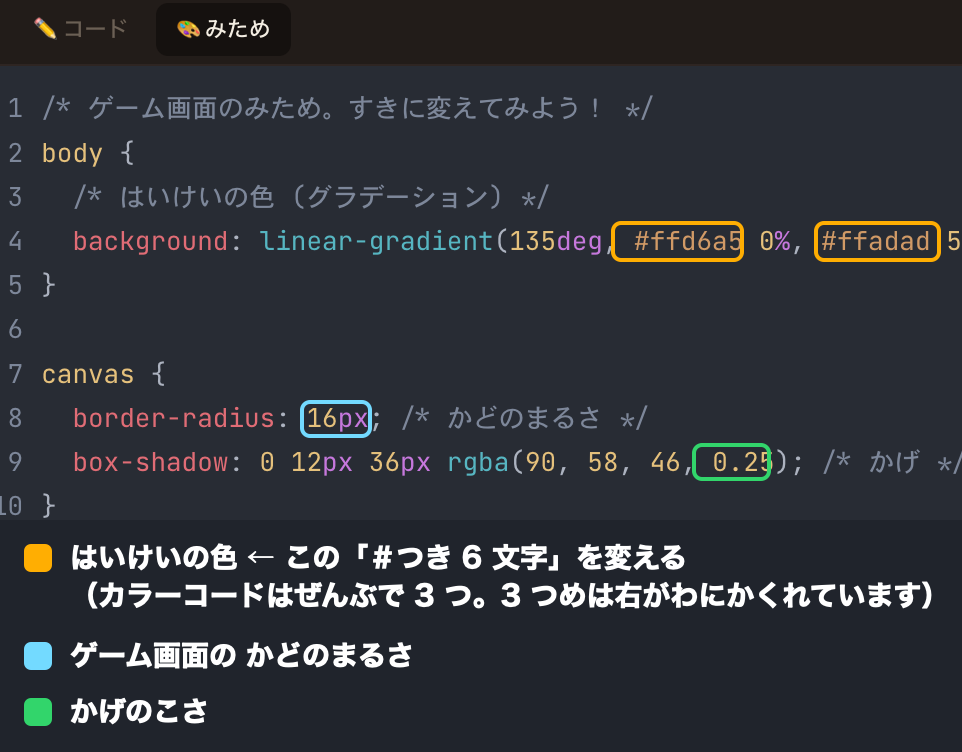
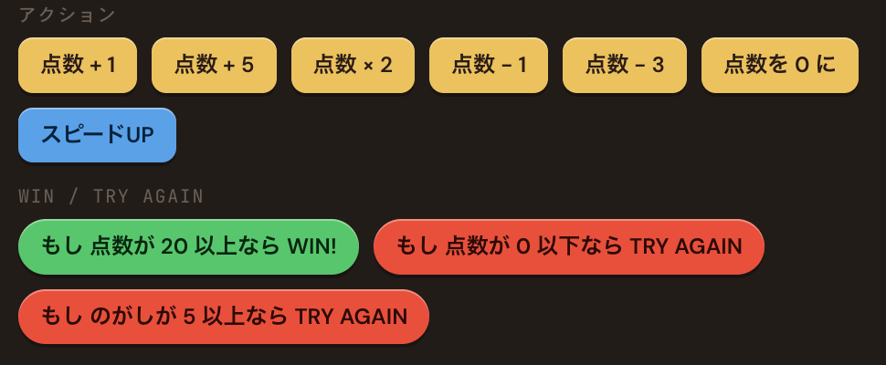

# 🍎 りんごキャッチ

**ブロックをならべて、コードでゲームを動かそう**

りんごキャッチ 1 時間プログラミング体験用ガイドです。
プログラミングを **初めてやる人向け** に書いてあります。困ったらこのページに戻ってきてください。



### 始め方

ブラウザで、リンクを開くだけです。インストールは何もいりません。
(リンクはPCの"メモ"アプリにあります)

---

## 目次

1. [このプログラミング体験でやること](#このプログラミング体験でやること)
2. [画面の見方](#画面の見方)
3. [ステップ 1：ブロックを 1 個置いてみる](#ステップ-1ブロックを-1-個置いてみる)
4. [ステップ 2：のがしたときを決める](#ステップ-2のがしたときを決める)
5. [ステップ 3：WIN と TRY AGAIN をつける](#ステップ-3win-と-try-again-をつける)
6. [ステップ 4：みためを変える](#ステップ-4みためを変える)
7. [発展：自分で CSS を書き足してみよう](#発展自分で-css-を書き足してみよう)
8. [ブロック図鑑](#ブロック図鑑)
9. [コードの読み方](#コードの読み方)
10. [発展：コードを直接書き換えてみよう](#発展コードを直接書き換えてみよう)
11. [困ったとき](#困ったとき)
12. [最後に](#最後に)

---

## このプログラミング体験でやること

やることは、たった **3 つ** です。

| | やること | 説明 |
| :-: | --- | --- |
| 1️⃣ | **ブロックを並べる** | 「点数 +1」のようなブロックを、ドラッグして並べます |
| 2️⃣ | **コードが自動でできる** | 並べたブロックが、そのまま右側の**本物のコード**になります |
| 3️⃣ | **ゲームが変わる** | 変えたらすぐ、真ん中のゲームの動きが変わります |



> 💡 **難しい文字を打つ必要はありません。** ブロックを並べるだけで、プロのエンジニアが書くのと同じ形のコードができます。

### ゴール

**「自分が並べたブロックで、ゲームのルールが変わる」のを体験すること。**

- 上手につくることより、**まず動かしてみる**ことが大事です
- 「なんかヘンな動きになった」も大成功。それも自分でつくったルールです
- 分からなくなったら、**すぐメンターに聞いてください**

---

## 画面の見方

画面は **3 つ** に分かれています。



### ⬅️ 左：ブロック置き場 ＋ ルールを並べる場所

上半分に **使えるブロック**が並んでいます。
下半分が、ブロックを **並べる場所（スタック）** です。2 つあります。

| 並べる場所 | いつ動く？ |
| --- | --- |
| 🍎 **キャッチしたとき** | かごでりんごをキャッチした瞬間 |
| 💧 **のがしたとき** | りんごが下まで落ちてしまった瞬間 |



> からっぽだと、**何も起きません**。まずは 1 個置いてみましょう。

### ⬆️ 真ん中：ゲーム画面

- 上から **りんご 🍎** が落ちてきます
- 下の **かご** は、**マウスを動かす**とついてきます
- **Score** = 取れた点数 / **Missed** = のがした数



### ➡️ 右：コード（と、みため）

自分が並べたブロックが、**[JavaScript](https://developer.mozilla.org/ja/docs/Web/JavaScript) というプログラミング言語**に変わって出てきます。
右上でタブを切り替えられます。

| タブ | 何ができる？ |
| --- | --- |
| ✏️ **コード** | ブロックからできたコードを見る（読むだけでOK） |
| 🎨 **みため** | 背景の色や、ゲーム画面の形を変える（ここは自分で書き換えます） |



---

## ステップ 1：ブロックを 1 個置いてみる

最初は **これだけ** やってみましょう。

### やること

1. 左上の **`点数 +1`** ブロックを見つける
2. それを **🍎 キャッチしたとき** の枠まで **ドラッグ**する
   （ドラッグが難しければ、**ブロックをクリックするだけ**でも入ります）
3. マウスを動かして、かごでりんごをキャッチしてみる

### できたかどうかの確認

- **Score** の数字が増えた ✅
- 右の **コード**に、1 行増えた ✅

🎉 **おめでとう！これがプログラミングです。**
「キャッチしたら点数を 1 増やす」というルールを、自分でつくりました。

### 次に、いろいろ試してみよう

`点数 +1` を消して、他のブロックに変えてみましょう。

- `点数 × 2` にしたら？ → …あれ、ずっと 0 のままだ。**なぜだと思う？**
- `点数 + 5` にしたら？ → 一気にスコアが伸びる
- `スピードUP` を足したら？ → だんだん速くなって、難しくなる

<details>
<summary>💭 「点数 × 2」が 0 のままな理由（考えてから開こう）</summary>

点数は **0 から始まります**。そして **0 × 2 = 0**。
何回キャッチしても、0 を 2 倍しているだけなので、ずっと 0 のままです。

だから `点数 × 2` を使うときは、**先に `点数 +1` を置いて** 点数を 0 より大きくしておく必要があります。
`点数 +1` → `点数 × 2` の順に並べてみてください。一気に伸びます。

</details>

> 💡 **2 個以上並べてもOK。** 上から順番に実行されます。
> 例えば `点数 +1` と `スピードUP` を並べると、「点数が増えて、しかも速くなる」ゲームになります。

---

## ステップ 2：のがしたときを決める

今のままだと、りんごをのがしても **何も起きません**。
ここに **ペナルティ（バツ）** をつけると、ゲームらしくなります。

### やること

1. **`点数 − 1`** を **💧 のがしたとき** の枠にドラッグする
2. わざと 1 個のがしてみる → Score が減る

### 試してみよう

| 並べるブロック | どんなゲームになる？ |
| --- | --- |
| `点数 − 1` | 軽め。ちょっと損するだけ |
| `点数 − 3` | 厳しい。集中しないとすぐ減る |
| `点数を 0 に` | **超厳しい。** 1 回のがしたら全部パー |
| （からっぽ） | ゆるゆる。のがしても平気 |

> 💡 **ゲームバランス**を決めているのは、今自分です。
> 難しすぎても、簡単すぎても、面白くありません。**自分がちょうどいいと思う数字**を探してみてください。

---

## ステップ 3：WIN と TRY AGAIN をつける

まだ、このゲームには **終わりがありません**。
「もし ○○ なら 終わり」という **勝ち負けの条件** をつけましょう。

### 「もし」ブロック

左の **WIN / TRY AGAIN** のところにある、丸いブロックです。

| ブロック | 意味 |
| --- | --- |
| 🟢 `もし 点数が 20 以上なら WIN!` | 20 点取れたら勝ち |
| 🔴 `もし 点数が 0 以下なら TRY AGAIN` | 点数がなくなったら負け |
| 🔴 `もし のがしが 5 以上なら TRY AGAIN` | 5 回のがしたら負け |



### やること

1. `もし 点数が 20 以上なら WIN!` を **🍎 キャッチしたとき** にドラッグする
   - ⚠️ 大事：**`点数 +1` の下**に置きます（理由はこのあとのクイズで！）
2. `もし のがしが 5 以上なら TRY AGAIN` を **💧 のがしたとき** にドラッグする
3. 遊んでみる → 20 点で **WIN!**、5 回のがすと **TRY AGAIN**

### 順番はとても大事

コードは **上から順番に** 実行されます。だから、**並べる順番で結果が変わります。**

ここでクイズです。さっきは **A** の順に並べてもらいました。
もし **B** のように逆に並べたら、どうなると思いますか？

- **A**： `点数 +1` → `もし 点数が 20 以上なら WIN!`
- **B**： `もし 点数が 20 以上なら WIN!` → `点数 +1`

<details>
<summary>💭 答えを見る（B も実際に試してから開こう）</summary>

**B だと、勝つのが 1 回遅くなります。**

B では、点数を増やす **前**に「20 点いった？」と聞いてしまいます。
だから 20 個目をキャッチした瞬間は、まだ **19 点**として判定され、勝てません。
そのあと **21 個目**を取ったときに、やっと WIN! になります。

| 並べ方 | どうなる？ |
| --- | --- |
| **A**：`点数 +1` → `もし 20 以上なら WIN!` | ✅ ちょうど 20 点で勝てる |
| **B**：`もし 20 以上なら WIN!` → `点数 +1` | ⚠️ 21 点にならないと勝てない |

</details>

> 💡 これは **バグ**の原因で一番多いやつです。「動きがヘンだな」と思ったら、**並べた順番**を疑ってみてください。

---

## ステップ 4：みためを変える

ルールができたら、色を変えて **自分のゲーム**にしていきましょう。
右上の **🎨 みため** タブを開きます。



ここだけは、ブロックではなく **自分で文字を書き換えます**。
書いてあるのは **[CSS](https://developer.mozilla.org/ja/docs/Web/CSS)（シーエスエス）** という、**見た目専用の言語**です。

> 😌 CSS はゲームのルールとは **別もの**なので、ここをいじってもゲームは壊れません。
> どんどん試してみてください。

### まず変えられるのは、この 3 つ

| どこ | 変わるもの |
| --- | --- |
| `background:` の `#ffd6a5` みたいな文字 | 背景の色 |
| `border-radius: 16px` の数字 | ゲーム画面の **角の丸さ** |
| `box-shadow: ...` | ゲーム画面の **影** |

### やること：背景の色を変える

1. `#ffd6a5` のように **`#` から始まる 6 文字** を探す
2. それを別の色に書き換える（下の表からコピーでOK）
3. すぐに背景の色が変わる 🎉

`#` のあとの 6 文字は **カラーコード**といって、**色につけられた番号**です。
世界中のウェブサイトが、この番号で色を決めています。

#### そのまま使える色

`background:` の中には、カラーコードが **3 つ**並んでいます。

```css
background: linear-gradient(135deg, #ffd6a5 10%, #ffadad 50%, #fdffb6 100%);
/*                                  ↑1つめ      ↑2つめ      ↑3つめ        */
```

この 3 つが上から下へまざり合って、グラデーションになっています。
**3 つとも**、下の表の色に書き換えてみてください。

| テーマ | 1 つめ | 2 つめ | 3 つめ |
| --- | --- | --- | --- |
| 🌅 夕やけ（さいしょの色） | `#ffd6a5` | `#ffadad` | `#fdffb6` |
| 🌌 夜空 | `#1e3a8a` | `#312e81` | `#4c1d95` |
| 🌊 海のなか | `#caf0f8` | `#48cae4` | `#0077b6` |
| 🌿 森 | `#d8f3dc` | `#95d5b2` | `#2d6a4f` |
| 🍓 いちご | `#ffccd5` | `#ff8fa3` | `#c9184a` |
| 🌸 ゆめかわ | `#ffc8dd` | `#bde0fe` | `#cdb4db` |
| 🌇 ネオン | `#f72585` | `#7209b7` | `#3a0ca3` |
| 🖤 モノクロ | `#e9ecef` | `#adb5bd` | `#343a40` |

> 💡 **1 つだけ変えてもOK。** まず 1 つめだけ変えて、どこが変わるか見てみるのがおすすめです。

### もっとやってみる

| いじるところ | やってみること |
| --- | --- |
| `border-radius: 16px` | `0px` で **かくかく**、`50px` で **まるまる** |
| `box-shadow` の `0.25` | `0.6` にすると、影が **濃くなる** |
| `135deg` | `0deg` や `90deg` に変えると、グラデーションの **向き**が変わる |
| `10%` `50%` `100%` | 色が切り替わる **位置**。`50%` を `20%` にすると 2 つめの色が上に寄る |

> ⚠️ **打ち間違えると、反映されなくなります。**
> 原因のほとんどは、`;`（セミコロン）や `:`（コロン）、`{ }` をうっかり消してしまうこと。
> それと、**必ず半角で打つこと**（`＃` や `；` のような全角だと動きません）。
> 直せなくなったら、遠慮なくメンターを呼んでください。

---

## 発展：自分で CSS を書き足してみよう

ここまで終わった人へ。**表に書いてないことも、自分で書き足せます。**

やり方はいつも同じで、`canvas { }` か `body { }` の **`{ }` の中に 1 行足す**だけです。

```css
canvas {
  border-radius: 16px;
  box-shadow: 0 12px 36px rgba(90, 58, 46, 0.25);
  /* ここに 1 行足す;        ← こういうこと */
}
```

> 💡 **1 個ずつ足して、そのたびに画面を見る。** これが一番速いやり方です。
> 一度に 3 個足すと、どれが効いたのか分からなくなります。

### ① りんごの色まで変える 🍎 → 🫐

**`canvas { }` の中**に足す:

```css
filter: hue-rotate(120deg);
```

ゲーム画面の色が **全部**グルッと変わります。**りんごの色も変わります。**
`120deg` を `0` 〜 `360` で変えて、好きな色を探してみてください。

他にもこんなのがあります。

| 書くもの | どうなる？ |
| --- | --- |
| `filter: invert(1);` | 色が反転（ネガフィルムみたい） |
| `filter: saturate(3);` | 色がド派手になる |
| `filter: grayscale(1);` | 白黒（モノクロ映画みたい） |
| `filter: blur(2px);` | ぼやける（激ムズになるので注意！） |

### ② ゲーム画面に枠をつける

**`canvas { }` の中**に足す:

```css
border: 8px solid #ffffff;
```

`8px` が太さ、`#ffffff` が色。`solid` を `dashed` にすると点線の枠になります。

> 💡 白がぼんやりして見えにくいときは、**濃い色**（`#3a0ca3` など）にすると、はっきりします。

### ③ しま模様の背景にする

**`body { }` の `background:` の行**を、これに書き換える:

```css
background: repeating-linear-gradient(45deg, #ffd6a5 0 40px, #ffadad 40px 80px);
```

`linear-gradient` を `repeating-linear-gradient` にすると、**同じ模様が繰り返し**並びます。
`40px` を `10px` にすると細いしま、`100px` にすると太いしまになります。

### ④ 丸いグラデーションにする

同じく **`background:` の行**を書き換える:

```css
background: radial-gradient(circle, #fdffb6, #ffadad, #f72585);
```

`linear`（まっすぐ）ではなく `radial`（丸く）広がります。

### ⑤ マウスの形を変える

**`canvas { }` の中**に足す:

```css
cursor: crosshair;
```

`crosshair`（十字）の他に `pointer`（指）、`grab`（つかむ手）、`none`（見えなくなる！）が使えます。

### ⑥ ゲーム画面をふわふわ浮かせる

これは少し長いです。**一番下**（`}` の外）に足してください:

```css
@keyframes fuwafuwa {
  0%   { transform: translateY(0); }
  50%  { transform: translateY(-12px); }
  100% { transform: translateY(0); }
}

canvas {
  animation: fuwafuwa 2s ease-in-out infinite;
}
```

`@keyframes` は「アニメーションの手順書」です。
`0%`（初め）→ `50%`（真ん中）→ `100%`（終わり）で、どこにいるかを書いています。
`2s` は 2 秒で 1 往復、`infinite` は「ずっと繰り返す」という意味。

> 🎢 **おまけ（バグるかも）：** `canvas { }` に `transform: rotate(5deg);` を足すと画面が傾きます。
> 面白いけど、**かごがマウスとズレる**ことがあります。ズレたら、足した行を消せば元に戻ります。

### 自分で調べてみる

やりたいことが決まっているなら、**検索するのが一番速い**です。
エンジニアも毎日普通に検索しています。

- 「**css 角を丸くする**」
- 「**css 文字を光らせる**」
- 「**css グラデーション 見本**」

こんなふうに「**css ＋ やりたいこと**」で検索すると、書き方が出てきます。
見つけたコードを `{ }` の中に貼って、動いたら大成功です 🎉

> ⌨️ **みため（CSS）だけでなく、ゲームのルール（コード）も書き換えられます。**
> → [発展：コードを直接書き換えてみよう](#発展コードを直接書き換えてみよう)

---

## ブロック図鑑

使えるブロックの一覧です。迷ったらここを見てください。

### アクション（何かをする）

| ブロック | すること | おすすめの置き場所 |
| --- | --- | --- |
| `点数 + 1` | 点数を 1 増やす | 🍎 キャッチしたとき |
| `点数 + 5` | 点数を 5 増やす | 🍎 キャッチしたとき（大量得点！） |
| `点数 × 2` | 点数を 2 倍にする | 🍎 キャッチしたとき（※ 0 のままだと増えない） |
| `点数 − 1` | 点数を 1 減らす | 💧 のがしたとき |
| `点数 − 3` | 点数を 3 減らす | 💧 のがしたとき（厳しめ） |
| `点数を 0 に` | 点数を 0 に戻す | 💧 のがしたとき（超厳しい） |
| `スピードUP` | りんごを速くする | どちらでも（だんだん難しくなる） |

### WIN / TRY AGAIN（もし〜なら、終わり）

| ブロック | すること |
| --- | --- |
| `もし 点数が 20 以上なら WIN!` | 20 点以上で勝ち |
| `もし 点数が 0 以下なら TRY AGAIN` | 0 点以下で負け |
| `もし のがしが 5 以上なら TRY AGAIN` | 5 回のがしたら負け |



---

## コードの読み方

右側のコードは、ブロックを置けば **自動でできる**ので、書かなくても大丈夫。
でも **読めるとかっこいい**です。4 つだけ覚えれば、だいたい読めます。
（自分で書き換えたい人は、このあとの [発展：コードを直接書き換えてみよう](#発展コードを直接書き換えてみよう) へ）

### ① `function`（ファンクション）＝「〜したときの、やることリスト」

```javascript
// 🍎 をキャッチしたとき、上から順に実行する
function onCatch() {
  // ← ここに、キャッチしたときのブロックが入る
}
```

- `onCatch` = **on（〜したとき）＋ catch（キャッチ）** → 「キャッチしたとき」
- `onMiss` = **on ＋ miss（のがす）** → 「のがしたとき」
- `{` と `}` のあいだが、**やることリストの中身**です

### ② 上から順番に実行される

`{` から `}` まで、**上の行から下の行へ**、順番に実行されます。
だから左でブロックを並べた順番が、そのままコードの順番になります。

### ③ `=` は「同じ」ではなく「入れる」

ここだけは、**算数と意味が違います**。気をつけてください。

算数の `=` は「左と右が同じ」という意味ですよね。
でもプログラムの `=` は「**右で計算した答えを、左に入れる**」という意味です。

```javascript
score = score + 1;
```

これは「`score` と `score + 1` が同じ」ではありません。こういう順番で動きます。

1. **右側**の `score + 1` を計算する（今の点数に 1 を足す）
2. その答えを、**左側**の `score` に **入れ直す**

だから、点数が 5 のときにこの行を通ると、`5 + 1` を計算して、点数は **6 になります**。
「同じ」だと考えると意味不明ですが、「入れ直す」だと考えるとスッキリします。

> 💡 `score = score + 1` を **「点数を 1 増やす」** と読み替えられたら、もうバッチリです。
> なお `=` が 3 つならんだ `===` は、こちらは「**同じかどうかを調べる**」という別の意味になります。

### ④ `if`（イフ）＝「もし〜なら」

`もし 点数が 20 以上なら WIN!` のブロックは、コードだと `if` になります。
「もし条件があてはまったら、`{ }` の中をやる」という意味です。

### ⑤ `//` から後ろは、コンピュータが読まない

`//` で始まる行は **コメント**といって、**人間が読むためのメモ**です。
プログラムの動きには影響しません。

> 💡 **ブロックを 1 個置いて、コードのどこが増えたか見比べてみてください。** それが「自分が書いたコード」です。

### おまけ：2 つの言語を使っています

今日使った 2 つのタブは、実は **別々の言語**です。プロの現場でも、この 2 つを使い分けています。

| タブ | 言語 | やくわり |
| --- | --- | --- |
| ✏️ コード | **JavaScript** | ゲームの **ルール**（どう動くか）を決める |
| 🎨 みため | **CSS** | **見た目**（色や形）を決める |

---

## 発展：コードを直接書き換えてみよう

みため（CSS）だけでなく、**ゲームのルールそのもの**も自分で書き換えられます。
ここまで来たら、**ブロックには無い、自分だけのルール**が作れます。

### ⚠️ 先に、大事な約束

コードは **ブロックから自動で作られています**。だから、やる順番がとても大事。

1. **先に**、ブロックでルールを作る（ステップ 1〜3）
2. **そのあとで**、コードを書き足す

> 🚨 **コードを書いたあとにブロックをいじると、書いたコードは消えます。**
> ブロック → コードの **一方通行**だからです。
> 消えても失敗ではありません（そういう作りです）。もう一度書けば大丈夫。
> 心配な人は、書いたコードを **メモアプリにコピーしておく**と安心です。

### 💡 最強のコツ：ブロックを「辞書」として使う

書き方が分からなくなったら、**そのブロックを 1 個置いて、できたコードを見る。**
それがそのまま **お手本**になります。写して使えばOKです。

> 例：スピードを変える書き方が分からない → `スピードUP` を 1 個置いて、できた行を見る

---

### ① ランダムな点数にする 🎲

`点数 +1` が作った行を、これに書き換える:

```javascript
score = score + Math.floor(Math.random() * 5) + 1;
```

キャッチするたびに、**1〜5 点**がランダムで入ります。

- `Math.random()` は **0 以上 1 未満のランダムな小数**を作る
- `* 5` して `Math.floor()`（切り捨て）で **0〜4**
- `+ 1` して **1〜5** になる

> 🎯 `5` を `100` にすると、1 回で 100 点入ることもあります。

### ② 点数が偶数のときだけボーナス ✌️

`onCatch()` の中に:

```javascript
if (score % 2 === 0) {
  score = score + 2;
}
```

`%` は **割り算の余り**。`score % 2` が `0` なら偶数（2 で割り切れる）です。

> `===` は「**同じかどうか**」を調べる記号。`=` 1 個は「**入れる**」なので、別ものです。

### ③ 連続ボーナス（コンボ）🔥

**これはブロックでは作れません。** コードだからできるルールです。

まず、コードの **一番上**（`function` より前）に 1 行:

```javascript
let combo = 0;
```

`onCatch()` の `{ }` の中:

```javascript
combo = combo + 1;
score = score + 1;
if (combo >= 3) {
  score = score + 5;
  combo = 0;
}
```

`onMiss()` の `{ }` の中:

```javascript
combo = 0;
```

3 個連続でキャッチすると **+5 点**。1 個でものがすと 0 に戻ります。

`let` は「**新しい入れ物を作る**」という意味。
`combo` という入れ物が、**今何個連続なのか**を覚えてくれています。

### ④ 最初の 1 回だけ大ボーナス 🎁

一番上に:

```javascript
let firstCatch = true;
```

`onCatch()` の中に:

```javascript
if (firstCatch === true) {
  score = score + 10;
  firstCatch = false;
}
```

`true` / `false` は「**はい / いいえ**」だけを覚えておける入れ物。
1 回使ったら `false` にするので、**2 回目からは入りません**。

### ⑤ 点数が増えるほど、難しくする 📈

`onCatch()` の中に:

```javascript
if (score >= 10) {
  // ここに「スピードUP」ブロックが作る行を貼る
}
```

「10 点をこえたら、キャッチするたびに速くなる」＝ **だんだん本気になるゲーム**。
`{ }` の中に貼る行は、`スピードUP` を 1 個置いて確認してください（さっきの「辞書」のコツ）。

### ⑥ のがすほど、優しくする 🤝

⑤ の逆を、`onMiss()` の中に書きます。
`スピードUP` が作った行をコピーして、**`+` を `-` に変える**だけ。

苦戦している人ほど優しくなるので、**諦めずに続けられるゲーム**になります。
（プロのゲームでも実際に使われている工夫です）

> 🎉 **ブロックに無いルールを作れたら、それはもう「自分だけのゲーム」です。**

---

## 困ったとき

### よくある「あれ？」

| こうなった | たぶんこれ |
| --- | --- |
| ブロックを置いても、何も起きない | **置き場所**が違うかも（キャッチ／のがしを確認） |
| Score が増えない | 🍎 キャッチしたとき が **からっぽ**かも |
| `点数 × 2` にしたのに増えない | **0 × 2 = 0** だから。`点数 +1` を先に置こう |
| すぐ TRY AGAIN になる | ペナルティが強すぎるかも（`点数を 0 に` → `点数 − 1` に変えてみる） |
| りんごが速すぎる | `スピードUP` を消してみる |
| みためを変えたのに、何も変わらない | **全角**の文字が混ざってるかも。`;` `:` `#` `{ }` を消してないかも確認 |
| 自分で書いたコードが消えた | ブロックをいじると、コードは自動生成でリセットされます。**ブロックは先、コードはあと** |
| 全部元に戻したい | `クリア`を押す。元に戻せないので注意！ |

### メンターを呼ぶとき

**遠慮しないで、すぐ呼んでください。** 一人で止まっている時間が一番もったいないです。

こう伝えると、原因がすぐ見つかります。

> 1. **何をしたら**（例：「点数 +1 をキャッチしたときに入れたら」）
> 2. **どうなったか**（例：「Score が増えなかった」）
> 3. **どうなってほしかったか**（例：「1 ずつ増えてほしかった」）

---

## 最後に

このプログラミング体験で持ち帰ってほしいのは、これだけです。

> **「自分が並べたルールで、何かが動いた」**

うまく動かなくても、時間内に終わらなくても、まったく問題ありません。
今日並べた `if` と、順番に実行されるコードの考え方は、**世界中のエンジニアが毎日使っているもの**とまったく同じです。

楽しんでいってください 🍎

